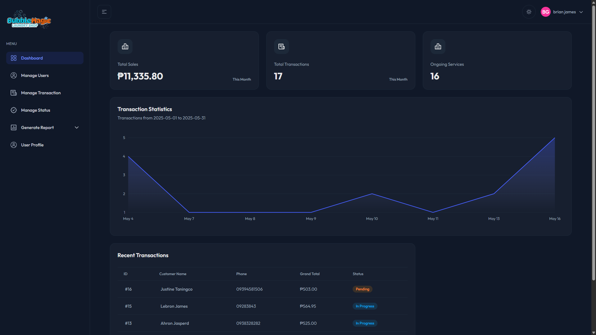

# Services and Sales Tracking Management System for Bubble Magic Laundry Shop

## Overview

The **Services and Sales Tracking Management System** is designed to streamline operations at Bubble Magic Laundry Shop. This system allows for efficient management of users, transactions, and sales reporting, enhancing the overall customer experience and operational efficiency.

## Technologies Used

- **JWT**: For secure user authentication.
- **React with TypeScript**: For building a dynamic and type-safe user interface.
- **Tailwind CSS**: For rapid and responsive UI design.
- **Django REST Framework**: For creating a robust backend API.
- **Axios**: For making HTTP requests to the backend.
- **ApexCharts**: For visualizing sales data and reports.
- **Lucide React**: For incorporating icons into the UI.
- **Shadcn**: For managing dialogs and popups.
- **React Toastify**: For displaying notifications to users.

## Features

### Manage Users

- Create, update, and delete user accounts.

### Login

- Secure login functionality using JWT for authentication.
- User session management to maintain logged-in state.

### Manage Transactions

- Record and track laundry transactions.
- Update transaction statuses as they progress through the workflow.

### Manage Status

- Monitor the status of ongoing transactions.
- Update statuses to reflect current progress (e.g., pending, completed).

### Sales Report

- Generate detailed sales reports to analyze revenue and performance.
- Visualize data using charts for better insights.
- Export data as Excel File for better decision making

### Customer Frequency Report

- Track customer visits and frequency of transactions.
- Generate reports to identify loyal customers and trends.
- Export data as Excel File for better decision making

## Getting Started

To get started with the Services and Sales Tracking Management System, follow these steps:

1. **Clone the Repository**:

2. **Install Dependencies**:
   Navigate to the project directory and install the required packages:

3. **Set Up the Backend**:
   Ensure that the Django REST Framework is set up and running. Configure the database and run migrations.

4. **Run the Application**:
   Start the development server:

5. **Access the Application**:
   Open your browser and navigate to `http://localhost:5173` to access the application.

## Conclusion

The Services and Sales Tracking Management System for Bubble Magic Laundry Shop is a comprehensive solution for managing laundry services efficiently. With its user-friendly interface and robust features, it aims to enhance operational efficiency and improve customer satisfaction.
